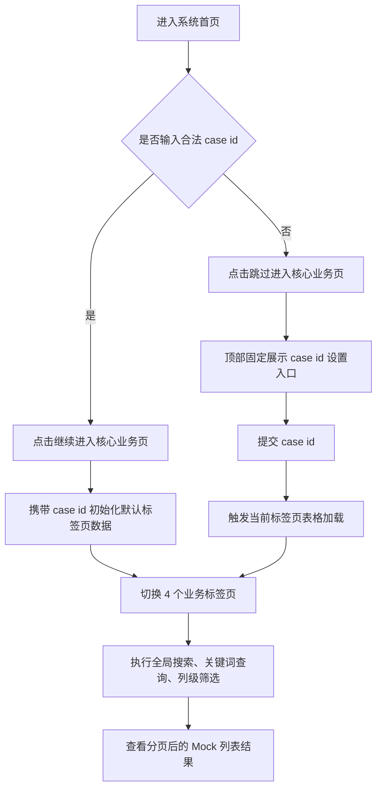

## 1. 产品概述
基于 Ant Design 构建一套桌面优先的案件管理系统，聚焦案件查询后的核心业务分析与信息浏览，不包含登录、注册能力。
- 解决调查人员在处理 case 时需要快速录入 case id、切换不同业务视角、检索表格数据的问题。
- 通过统一的标签页工作台、Mock Server 联调和响应式布局，形成可演示、可扩展的后台管理前端基础版本。

## 2. 核心功能

### 2.1 用户角色
| 角色 | 进入方式 | 核心权限 |
|------|----------|----------|
| 调查人员 | 直接访问系统首页 | 输入或跳过 case id，查看并检索 4 个业务标签页下的案件关联数据 |

### 2.2 功能模块
1. **系统入口页**：case id 输入、格式校验、继续进入、跳过进入。
2. **核心业务页**：案件头部信息区、4 个业务标签页、统一数据检索与表格展示。
3. **Mock 数据联调模块**：模拟 case 查询、按标签页加载列表、筛选搜索请求。

### 2.3 页面详情
| 页面名称 | 模块名称 | 功能描述 |
|---------|---------|---------|
| 系统入口页 | case id 输入框 | 支持输入案件编号，提供前端格式校验与错误提示。 |
| 系统入口页 | 继续按钮 | 输入合法 case id 后进入核心业务页，并携带 case id 初始化首个标签页数据。 |
| 系统入口页 | 跳过按钮 | 不要求输入 case id，直接进入核心业务页。 |
| 核心业务页 | 顶部案件控制区 | 展示当前 case id 状态；当通过“跳过”进入时，固定显示 case id 设置入口，提交后触发当前标签页数据加载。 |
| 核心业务页 | 标签页：KYC profile | 展示客户基础画像、证件、联系方式、职业、雇主、收入、国籍、全球曝光等信息。 |
| 核心业务页 | 标签页：Previous Investigation | 展示历史调查记录、调查类型、结论、评级、时间线等信息。 |
| 核心业务页 | 标签页：Transaction review | 展示交易对手、支票或股票名称、金额、状态、审查备注等信息。 |
| 核心业务页 | 标签页：Bad connections | 展示设备 ID、IP 地址、最近登录时间、位置、风险等级等信息。 |
| 核心业务页 | 高级表格区 | 每个标签页均使用 Ant Design 高级表格组件，支持分页、列配置、排序、列级筛选。 |
| 核心业务页 | 全局搜索与关键词查询 | 支持关键字搜索、按字段筛选、重置条件、快速定位目标数据。 |
| 核心业务页 | 响应式布局 | 在桌面、平板、窄屏下保持可用性，表格与头部区域自适应折叠。 |
| 系统全局 | 基础测试 | 覆盖入口页跳转、跳过逻辑、case id 提交、标签页切换、表格加载与检索交互。 |

## 3. 核心流程
用户进入首页后，可选择输入合法 case id 并点击“继续”进入业务页，也可通过“跳过”直接进入业务页。若未携带 case id，业务页顶部固定展示 case id 设置入口，用户提交后立即对当前激活标签页发起 Mock 请求并刷新表格。随后用户可切换不同业务标签页，在各标签页中通过搜索、列筛选、关键字查询定位所需数据。

## 4. 用户界面设计
### 4.1 设计风格
- 主色：深蓝灰 + Ant Design 品牌蓝，强调专业、审慎的案件调查氛围。
- 辅助色：青色和金橙色用于状态、风险等级、操作提示。
- 按钮样式：圆角中等、轻阴影、主按钮高对比度，符合企业后台规范。
- 字体与字号：采用系统可用无衬线字体栈，标题层级清晰，表格信息密度适中。
- 布局风格：顶部信息带 + 标签页工作区 + 卡片化高级表格，桌面优先。
- 图标建议：使用 Ant Design 图标，避免额外视觉噪声。

### 4.2 页面设计概览
| 页面名称 | 模块名称 | UI 元素 |
|---------|---------|---------|
| 系统入口页 | 中央输入区 | 居中卡片、明确标题说明、case id 输入框、继续与跳过两个主操作。 |
| 核心业务页 | 顶部控制条 | 页面标题、case id 状态标签、输入框、提交按钮、提示文案。 |
| 核心业务页 | 标签页导航 | 4 个固定标题标签，切换动画克制，当前标签高亮。 |
| 核心业务页 | 表格工具栏 | 搜索框、筛选器、刷新、重置、结果统计。 |
| 核心业务页 | 高级表格内容区 | 分页表格、列筛选下拉、状态标签、风险等级色彩提示。 |

### 4.3 响应式策略
- 采用桌面优先设计，在 1200px 以上保持完整工作台布局。
- 平板尺寸下顶部控制区自动换行，表格工具栏分两行显示。
- 窄屏下保留标签页与核心搜索能力，表格允许横向滚动，避免信息截断。
- 按钮、输入框、表格间距遵循 Ant Design 响应式栅格规范。
