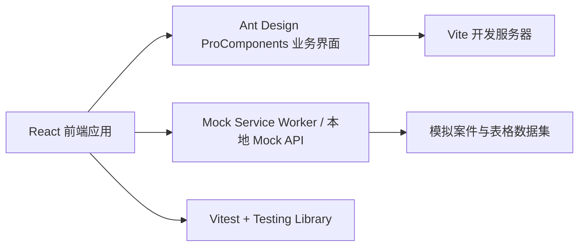
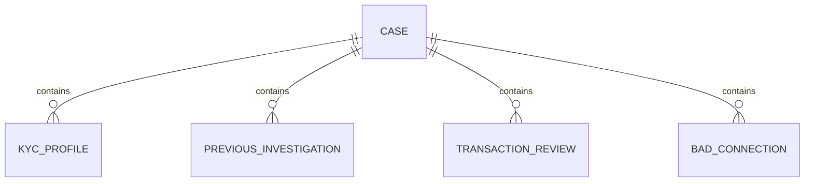

## 1. 架构设计



## 2. 技术说明
- 前端：React 18 + TypeScript + Vite
- UI 框架：Ant Design 5 + @ant-design/pro-components
- 路由：react-router-dom 6
- 状态管理：React Context + 局部状态管理
- Mock 能力：Mock Service Worker（MSW）或基于 Vite 的本地 Mock 方案
- 测试：Vitest + React Testing Library + jsdom
- 样式：Ant Design Token + 少量定制 CSS
- 初始化工具：Vite
- 后端：无真实后端，全部通过 Mock Server 模拟联调

## 3. 路由定义
| 路由 | 用途 |
|------|------|
| / | 系统入口页，负责 case id 输入、合法性校验与跳转 |
| /workspace | 核心业务页，承载案件头部信息、标签页和高级表格 |

## 4. API 定义

### 4.1 case id 校验规则
- 建议格式：`CASE-YYYY-NNNN`，例如 `CASE-2026-0001`
- 前端执行正则校验：`^CASE-\d{4}-\d{4}$`

### 4.2 接口列表
| 方法 | 地址 | 用途 |
|------|------|------|
| GET | /api/cases/:caseId/summary | 获取案件摘要信息，用于核心业务页顶部展示 |
| GET | /api/cases/:caseId/kyc-profile | 获取 `KYC profile` 标签页列表 |
| GET | /api/cases/:caseId/previous-investigation | 获取 `Previous Investigation` 标签页列表 |
| GET | /api/cases/:caseId/transaction-review | 获取 `Transaction review` 标签页列表 |
| GET | /api/cases/:caseId/bad-connections | 获取 `Bad connections` 标签页列表 |

### 4.3 查询参数约定
所有列表接口统一支持以下参数：
- `page`：页码
- `pageSize`：每页条数
- `keyword`：关键词查询
- `globalSearch`：全局搜索词
- `filters`：列级筛选条件集合
- `sortField`：排序字段
- `sortOrder`：排序方向

### 4.4 TypeScript 类型定义
```ts
export type CaseSummary = {
  caseId: string;
  status: 'ready' | 'pending_case_id';
  owner: string;
  updatedAt: string;
};

export type TableQuery = {
  page?: number;
  pageSize?: number;
  keyword?: string;
  globalSearch?: string;
  sortField?: string;
  sortOrder?: 'ascend' | 'descend';
  filters?: Record<string, string[]>;
};

export type PagedResult<T> = {
  data: T[];
  total: number;
  success: boolean;
};
```

## 5. 前端模块划分
| 模块 | 职责 |
|------|------|
| `pages/EntryPage` | 首页输入、格式校验、路由跳转 |
| `pages/WorkspacePage` | 核心业务页布局、标签页切换、case id 状态控制 |
| `components/CaseHeader` | 顶部固定案件控制区 |
| `components/WorkspaceTabs` | 4 个业务标签与当前标签状态同步 |
| `components/tables/*` | 各标签页高级表格封装 |
| `mocks/handlers` | Mock 接口定义、筛选/分页/搜索逻辑 |
| `tests/*` | 交互与渲染测试 |

## 6. 数据模型

### 6.1 业务实体


### 6.2 实体字段建议
- `KYC profile`：id、customerId、prcId、entryPermitId、cinNumber、customerSince、rmManaged、address、email、mobile、occupation、employer、salary、nationality、workplace、gsnaExposure
- `Previous Investigation`：id、investigationType、referenceCode、previousOwner、riskCategory、conclusion、openedAt、closedAt、note
- `Transaction review`：id、counterparty、instrumentType、instrumentName、amount、currency、bookingDate、reviewStatus、reviewer、comment
- `Bad connections`：id、deviceId、ipAddress、lastLoginAt、location、riskLevel、relationType、comment

## 7. 测试策略
- 单元与组件测试覆盖：
  1. 入口页合法 case id 可进入业务页。
  2. 非法 case id 阻止继续并展示校验反馈。
  3. 点击跳过后进入业务页且顶部显示 case id 设置入口。
  4. 提交 case id 后触发当前标签页数据加载。
  5. 标签页切换后能够发起对应 Mock 请求并渲染表格。
  6. 搜索、关键词查询、列级筛选可更新表格结果。
- 响应式验证：
  1. 核心页面在桌面和平板宽度下布局不重叠。
  2. 表格窄屏下允许横向滚动且搜索区可折行。

## 8. 实施约束
- 不实现登录、注册、权限体系。
- 所有表格数据必须来源于 Mock Server，不以内嵌静态表格替代。
- 4 个标签页标题必须严格使用：`KYC profile`、`Previous Investigation`、`Transaction review`、`Bad connections`。
- 跳过入口进入后，未设置 case id 前不加载业务数据，并在表格区域给予提示。
